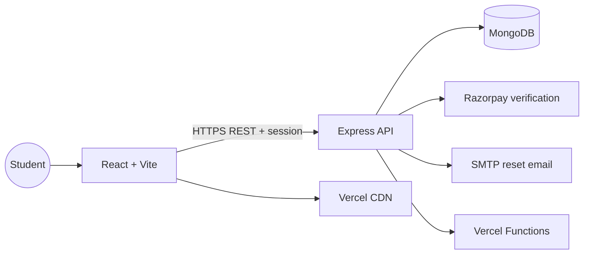

<div align="center">

# 🌈 CodePath Learning


<p><b>A colourful, practical learning platform for the next generation of builders.</b></p>

<a href="https://www.codepathlearning.co.in"></a>
<a href="https://codepath-learning-api.vercel.app/api/health"></a>

<br /><br />


</div>

<br />

<div align="center">


</div>

## ⚡ A guided path from first line of code to first opportunity

```text
  Discover  ──▶  Learn  ──▶  Practise  ──▶  Build  ──▶  Grow
      ✦             ✦             ✦             ✦             ✦
   courses       live help     projects      portfolio     careers
```

<div align="center">

 ➜  ➜  ➜ 

</div>

> **CodePath Learning** helps students learn programming by building projects, accessing structured courses, joining verified mentorship and exploring real government-career pathways.

## ✨ The experience

| 🎨 Learn | 🧩 Build | 🚀 Grow |
|---|---|---|
| Practical programming courses, syllabus packs and bilingual content | Hands-on projects, assignments and protected student resources | Certificates, feedback, mentorship and career guidance |

## 🪄 Product highlights

<table>
<tr>
<td width="50%"><b>🌐 Bilingual by design</b><br/>Switch the complete rendered experience between English and हिन्दी.</td>
<td width="50%"><b>💳 Safe payments</b><br/>Server-side Razorpay verification, receipts and manual UPI review.</td>
</tr>
<tr>
<td><b>🔐 Secure accounts</b><br/>Bcrypt passwords, sessions and SHA-256 reset-token storage.</td>
<td><b>🎯 Career pathways</b><br/>Mentorship plus a 50-card Diploma Government Jobs guide.</td>
</tr>
<tr>
<td><b>📚 Protected learning</b><br/>Paid-course access controls, resources and certificates.</td>
<td><b>💬 Student voice</b><br/>Feedback and rating flow for continuous improvement.</td>
</tr>
</table>

## 🏗️ How it works



## 🧰 Run it locally

```bash
git clone https://github.com/khushisoni2004/codepath-learning.git
cd codepath-learning

# terminal 1 — API
cd backend
npm install
cp .env.example .env.local
npm run dev

# terminal 2 — frontend
cd frontend
npm install
cp .env.example .env.local
npm run dev
```

## ✅ Verify before release

```bash
cd frontend && npm run build
cd ../backend && npm test
```

## 🔒 Public repository safety

Only reusable source code, public assets and documentation belong in GitHub. Never commit `.env`, `.env.local`, MongoDB URLs, SMTP passwords, Razorpay secrets, admin keys, sessions, student records or private payment uploads. Production values belong in Vercel environment variables.

Placeholder configuration is documented in [`backend/.env.example`](backend/.env.example) and [`frontend/.env.example`](frontend/.env.example).

## 🌍 Production

| Surface | URL |
|---|---|
| Frontend | [www.codepathlearning.co.in](https://www.codepathlearning.co.in) |
| Backend health | [codepath-learning-api.vercel.app/api/health](https://codepath-learning-api.vercel.app/api/health) |

## 💜 Built for learners

CodePath Learning is maintained with a focus on clear teaching, safe payments, reliable access control and a delightful student experience.

### 👥 Team

**Founder:** Khushi Soni  ·  **Co-founder:** Rudra Choudhary

### 🧭 Project principles

| Principle | What it means in the product |
|---|---|
| **Clarity** | Short explanations, structured syllabi and focused next steps |
| **Practice** | Projects, assignments, notes and hands-on learning |
| **Trust** | Secure credentials, verified payments and privacy-safe deployment |
| **Opportunity** | Mentorship and carefully organised government-career research |

<div align="center">


</div>

<div align="center">

### ⭐ Learn something. Build something. Share something.


</div>
