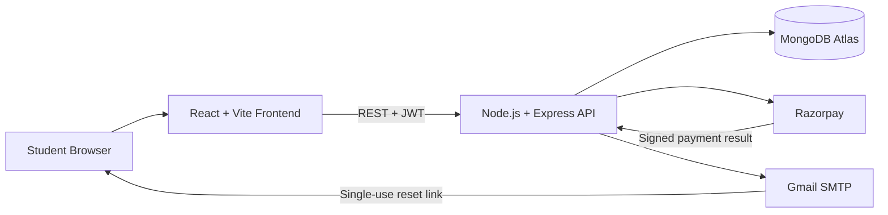
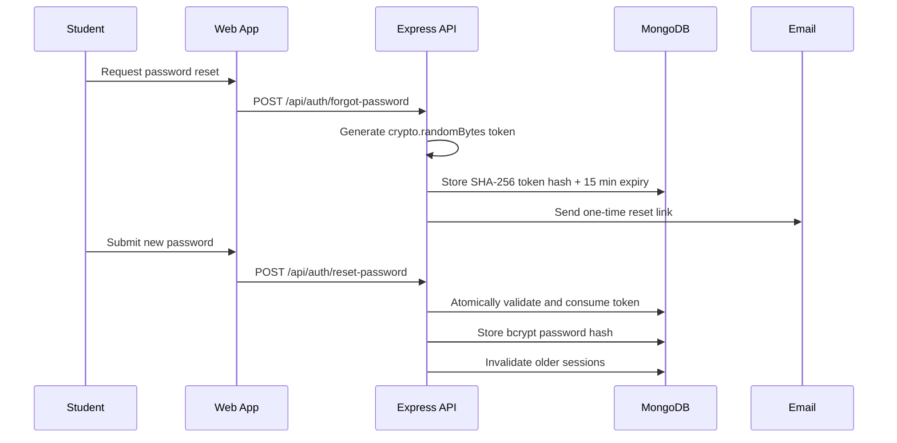

<div align="center">


<p>
  
  
  
  
</p>

<p>
  
  
  
  
</p>

[](https://www.codepathlearning.co.in/)
&nbsp;
[](https://github.com/khushisoni2004/codepath-learning)

<br/>

**[Overview](#-overview) • [Features](#-platform-features) • [Architecture](#-architecture) • [Security](#-authentication--security) • [Courses](#-courses) • [Setup](#-local-development) • [API](#-api-overview) • [Deployment](#-deployment)**

</div>

---

## ✦ Overview

**CodePath Learning** is a full-stack learning and enrollment platform created for diploma students and coding beginners. It combines beginner-friendly course discovery with student registration, secure backend authentication, verified Razorpay payments, receipts, paid-course access, registration verification, and certificate information.

The learning experience is designed around simple Hindi-English explanations, practical exercises, structured assignments, mini projects, and responsible use of modern AI tools.

> **Our purpose:** help students learn coding confidently, practise real skills, and build meaningful projects.

<div align="center">

### Practical Learning · Real Skills · Smart Projects


</div>

---

## ✦ Platform Features

<table>
<tr>
<td width="50%" valign="top">

### 🎓 Student Experience

- Responsive course discovery
- Structured syllabus downloads
- Student registration and verification
- Secure email/password login
- Forgot and reset password flow
- Registration details dashboard
- Paid-course access status
- Certificate policy and guidance

</td>
<td width="50%" valign="top">

### ⚙️ Platform Operations

- Backend bcrypt password hashing
- Signed JWT authentication
- MongoDB-backed student records
- Razorpay order and signature verification
- Payment ownership validation
- Receipt generation
- Admin payment verification
- Production frontend and API deployments

</td>
</tr>
</table>

---

## ✦ Architecture



| Layer | Technology | Responsibility |
|:--|:--|:--|
| Frontend | React, Vite, React Router | Pages, forms, course experience, payment UI |
| Backend | Node.js, Express | Authentication, authorization, payments, receipts, APIs |
| Database | MongoDB, Mongoose | Users, registrations, payments, enrollment records |
| Authentication | bcrypt, JWT | Password hashing and signed backend sessions |
| Payments | Razorpay | Orders, checkout, signature verification |
| Email | Nodemailer, Gmail SMTP | Secure password-reset delivery |
| Hosting | Vercel | Production frontend and backend deployments |

---

## ✦ Authentication & Security

Authentication is handled entirely by the backend. Raw passwords and raw reset tokens are never stored.



Security controls include:

- bcrypt password hashing with cost factor 12
- Signed seven-day JWT sessions
- Server-side authorization for payment APIs
- Cryptographically random reset tokens
- SHA-256 reset-token storage
- 15-minute expiration
- Atomic single-use token consumption
- Generic forgot-password responses to prevent user enumeration
- Session invalidation after password reset
- Sensitive environment variables excluded from Git

---

## ✦ Courses

| Course | Learning Outcomes |
|:--|:--|
| 🌐 **Web Development** | HTML, CSS, JavaScript, responsive layouts, DOM, forms, portfolio development |
| 🐍 **Python Programming** | Variables, decisions, loops, functions, files, practical Python programs |
| 💻 **C Programming** | Data types, operators, control flow, arrays, functions, pointers |
| 🗄️ **MySQL Database** | Tables, queries, CRUD operations, joins, data management |
| ⚡ **Vibe Coding with AI** | Prompting, prototyping, debugging, AI-assisted project creation |
| 🧠 **AI Tools for Smart Projects** | ChatGPT, GitHub Copilot, Canva AI, automation, responsible AI use |

---

## ✦ Project Structure

```text
codepath-learning/
├── frontend/
│   ├── public/              # Static assets and learning resources
│   ├── src/
│   │   ├── components/      # Shared interface components
│   │   ├── context/         # Backend authentication state
│   │   ├── pages/           # Website pages and reset flow
│   │   ├── services/        # API and payment requests
│   │   └── styles/          # Responsive styling
│   └── vercel.json
├── backend/
│   ├── controllers/         # Payment operations
│   ├── middleware/          # JWT authentication
│   ├── models/              # MongoDB schemas
│   ├── routes/              # REST endpoints
│   ├── test/                # Authentication security tests
│   ├── utils/               # Tokens, email, registration IDs
│   └── server.js
└── README.md
```

---

## ✦ Local Development

### Requirements

- Node.js 22+
- npm
- MongoDB connection
- Razorpay test credentials
- SMTP credentials for password-reset email

### 1. Clone

```bash
git clone https://github.com/khushisoni2004/codepath-learning.git
cd codepath-learning
```

### 2. Backend

```bash
cd backend
cp .env.example .env
npm install
npm run dev
```

### 3. Frontend

```bash
cd frontend
cp .env.example .env
npm install
npm run dev
```

The frontend runs at `http://localhost:5173` and the backend defaults to `http://localhost:5001`.

### Environment safety

Only `.env.example` files belong in Git. Real `.env`, `.env.local`, production credentials, private keys, database URLs, JWT secrets, SMTP passwords, and Razorpay secrets are ignored and must remain in Vercel environment settings.

---

## ✦ API Overview

### Authentication

| Method | Route | Purpose |
|:--|:--|:--|
| `POST` | `/api/auth/register` | Create a backend account |
| `POST` | `/api/auth/login` | Verify password and issue a session |
| `GET` | `/api/auth/me` | Return the authenticated profile |
| `POST` | `/api/auth/forgot-password` | Send a generic reset response and email if eligible |
| `POST` | `/api/auth/reset-password` | Consume a reset token and replace the password |

### Registration and payments

| Method | Route | Purpose |
|:--|:--|:--|
| `POST` | `/api/registrations` | Create a course registration |
| `GET` | `/api/registrations/verify/:registrationId` | Verify registration information |
| `POST` | `/api/payments/create-order` | Create an authenticated Razorpay order |
| `POST` | `/api/payments/verify` | Verify the Razorpay signature |
| `GET` | `/api/payments/my-courses` | Return paid-course access |
| `GET` | `/api/payments/receipt/:paymentId` | Return an owned payment receipt |

---

## ✦ Verification

```bash
cd backend && npm test
cd frontend && npm run build
```

The authentication suite covers backend registration, bcrypt login, reset-token hashing, expiration/invalid-token handling, password validation, session invalidation, and replay prevention.

---

## ✦ Deployment

| Application | Vercel Project | Root Directory |
|:--|:--|:--|
| Frontend | `codepath-learning` | `frontend` |
| Backend API | `codepath-learning-api` | `backend` or the backend repository root |

Production secrets are configured only in Vercel. A deployment must never contain committed `.env` files.

---

## ✦ Founder

<div align="center">


### Khushi Soni

**Founder · Educator · Platform Developer**

</div>

CodePath Learning was founded with the vision of making coding education more practical, understandable, and accessible for diploma students. The platform helps learners strengthen fundamentals, gain practical experience, and build meaningful projects with modern technologies.

---

## ✦ Contact

<div align="center">

[](https://www.codepathlearning.co.in/)
[](mailto:codepathlearning@gmail.com)

<br/>


**© 2026 CodePath Learning · Learn · Practice · Build**

</div>
