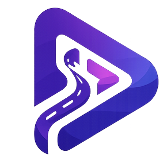

<div align="center">



# 🚀 CodePath Learning

### Learn • Practice • Build


<br/>

[](https://react.dev/)
[](https://vite.dev/)
[](https://nodejs.org/)
[](https://expressjs.com/)
[](https://www.mongodb.com/)
[](https://razorpay.com/)

<br/>

[🌐 Live Website](https://codepathlearning.co.in)
&nbsp;&nbsp;•&nbsp;&nbsp;
[📚 Explore Courses](https://codepathlearning.co.in/courses)
&nbsp;&nbsp;•&nbsp;&nbsp;
[✅ Verify Registration](https://codepathlearning.co.in/verify)

</div>

---

## 🌟 About CodePath Learning

**CodePath Learning** is a beginner-friendly coding education platform designed to make programming simple, practical and accessible.

Students learn through:

- Live Hindi-English classes
- Beginner-friendly explanations
- Practical assignments
- Mini projects
- Coding notes and resources
- Secure online enrollment
- Registration verification
- Course completion assessment

The platform focuses on helping beginners move from basic concepts to real project development.

---

## ✨ Platform Highlights

<table>
<tr>
<td width="50%">

### 🎓 Student Learning

- Structured programming courses
- Practical coding exercises
- Course-specific syllabus
- Beginner-friendly notes
- Live classes
- Google Classroom support
- Mini project development

</td>
<td width="50%">

### 🔐 Secure Platform

- User registration and login
- JWT-based authentication
- Secure Razorpay payment flow
- Backend payment verification
- Course enrollment tracking
- Registration verification
- Payment receipt generation

</td>
</tr>
</table>

---

## 📚 Available Courses

| Course | Main Topics |
|---|---|
| 🌐 Web Development | HTML, CSS, JavaScript, Bootstrap, Responsive Design |
| 🐍 Python Programming | Python Basics, Functions, Files, OOP and Projects |
| 💻 C Programming | Variables, Loops, Arrays, Functions and Pointers |
| 🗄️ MySQL | Database Basics, Queries, Joins and CRUD Operations |
| 🧩 Object-Oriented Programming | Classes, Objects, Inheritance and Polymorphism |
| 🧠 Data Structures and Algorithms | Arrays, Strings, Searching, Sorting and Problem Solving |
| 🤖 Vibe Coding and AI Tools | AI-assisted development, prompts and productivity tools |

---

## 🖥️ Website Features

- Responsive and modern homepage
- Animated course cards
- Detailed course syllabus pages
- Student login and registration
- Buy Now enrollment popup
- Razorpay payment integration
- Backend payment signature verification
- Paid-course status tracking
- Student registration verification
- Receipt generation
- Notes and learning resources
- Mobile-friendly navigation
- Google Classroom integration
- WhatsApp community integration
- Admin-protected operations

---

## 🛠️ Technology Stack

### Frontend

<p>

</p>

- React
- Vite
- JavaScript
- HTML5
- CSS3
- React Router

### Backend

<p>

</p>

- Node.js
- Express.js
- MongoDB
- Mongoose
- JWT Authentication
- Razorpay API

### Deployment

<p>

</p>

- Vercel
- Render
- MongoDB Atlas
- GitHub
- Custom Domain

---

## 📂 Project Structure

```text
codepath-learning/
│
├── frontend/
│   ├── public/
│   ├── src/
│   │   ├── assets/
│   │   ├── components/
│   │   ├── pages/
│   │   ├── services/
│   │   └── App.jsx
│   ├── package.json
│   └── vite.config.js
│
├── backend/
│   ├── config/
│   ├── controllers/
│   ├── middleware/
│   ├── models/
│   ├── routes/
│   ├── server.js
│   └── package.json
│
├── README.md
└── .gitignore
